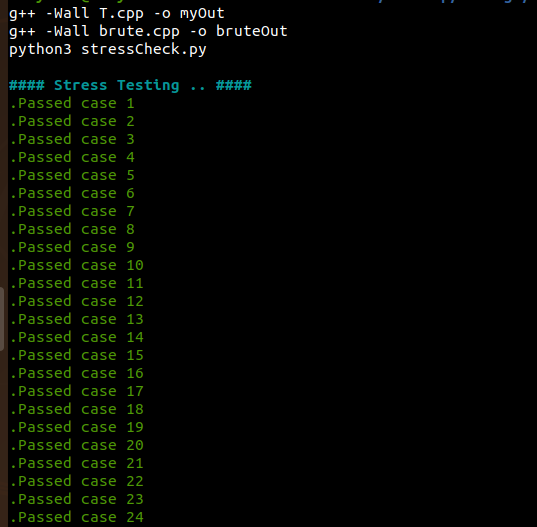
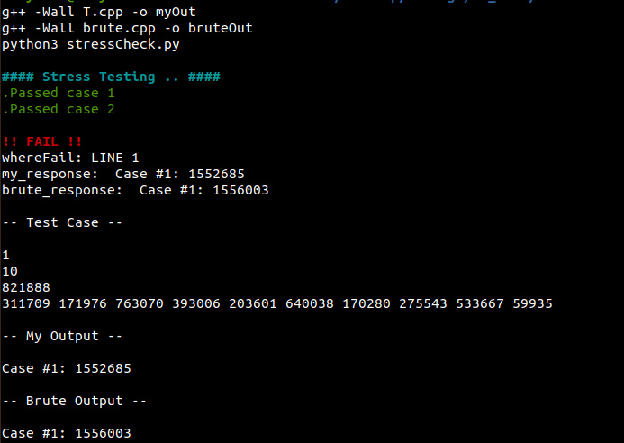

# STRESS TEST
#### A stress testing script made by me (finally! :confounded:), in order to test your solutions against brute solutions.

## What is stress testing?
*I shall speak here in reference with Competitve Programming :bow:.*

For optimization problems sometimes your optimized code tends to fail on corner cases which are rather hard to figure out leading to a series of WA/TLE verdicts.

To overcome such annoying issues of brainstorming the aforementioned corner cases yourself, the naive idea of stress testing comes into play.

For the very same problem, you quickly code out a brute solution and hopefully with the help of my script :ok_man: and a random case generator (User parameter), you compare your output against the brute output (User parameter) and hope for a **fail verdict** and *voilà*, you get the test case your code was failing on!

#### Please refer *user.py* for modelling required user parameters!

## Preview





## How to use
* Set your configuration in `user.py`.
    * This includes configuration parameters such as logs, number of test cases, etc.
    * Create your `gen_case` function.
    * Create your `checker` function.
* Code an optimized solution for the problem. Code it in `sols/main.cpp`.
* Code a brute solution for the problem. Code it in `sols/brute.cpp`.
* Run `make stress` & wait to hopefully retrieve a corner case, lol.

```
Currently supported on Linux/Mac
```

#### All contributions are welcomed! :hand:

